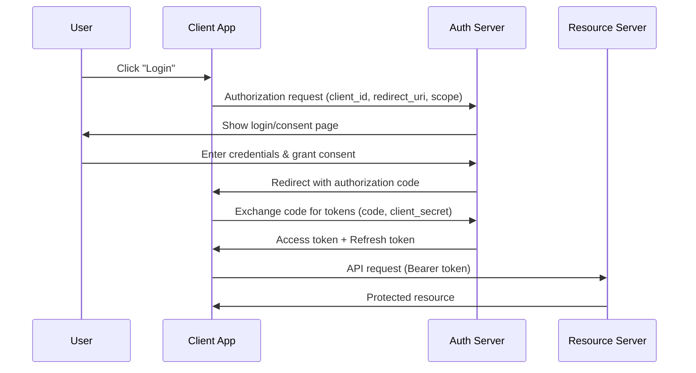
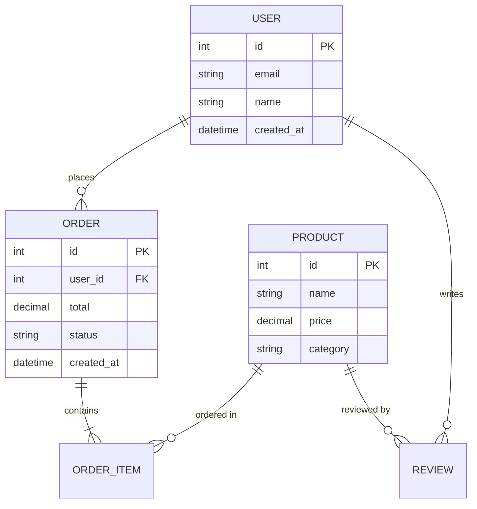

# Mermaid Diagram Generator

Generate Mermaid diagram code blocks from natural language descriptions.

## When to use

- Need to visualize a process, flow, or architecture
- Creating diagrams for documentation (PRD, TRD, ADR)
- Want a quick diagram from a verbal description
- **Lightweight** — no document structure, just the diagram

## Inputs

- **Required**:
  - `description`: What to diagram (verbal description or structured data)
- **Optional**:
  - `diagram_type`: flowchart / sequence / er / c4 / gantt / pie / state / classDiagram (auto-detected if omitted)
  - `style`: minimal / detailed (default: detailed)

## Workflow

1. **Analyze description**: Determine the best diagram type if not specified.

2. **Generate Mermaid code**: Produce valid Mermaid syntax:
   - Use clear node labels
   - Add meaningful edge labels
   - Group related items with subgraphs where appropriate
   - Apply direction (TD/LR) based on content flow

3. **Validate syntax**: Ensure the Mermaid code is syntactically correct (matching brackets, valid node IDs, proper arrow syntax).

4. **Present**: Output as a fenced Mermaid code block.

## Output Contract

- **Format**: Mermaid code block (` ```mermaid `)
- **No frontmatter** — this is a utility skill, not a document generator
- Multiple diagrams if the description covers different aspects

## Supported Diagram Types

| Type | Use Case | Example Trigger |
|------|----------|-----------------|
| flowchart | Process flows, decision trees | "Draw the checkout flow" |
| sequence | API calls, system interactions | "Show the auth sequence" |
| erDiagram | Data models, entity relationships | "ER diagram for users and orders" |
| C4Context / C4Container | System architecture | "Architecture diagram for our platform" |
| gantt | Project timelines | "Show the release timeline" |
| stateDiagram-v2 | State machines | "Order status transitions" |
| classDiagram | Class relationships | "Class diagram for the domain model" |
| pie | Distribution/breakdown | "Show traffic by source" |

## Conventions

This is a **utility skill** (no formal document schema). Follow `skills/product-dev/_shared/gen-conventions.md` for safety boundaries. No YAML frontmatter in output.

## Failure Handling

- Ambiguous description → ask one clarifying question about scope or diagram type
- Too complex for one diagram → split into multiple diagrams with explanation
- Unsupported diagram type → suggest closest supported type

## Examples

### Example 1: Authentication flow

**User**: Draw a sequence diagram for OAuth2 authorization code flow.

**Expected Output**:



### Example 2: ER diagram

**User**: ER diagram for e-commerce: users, orders, products, reviews.

**Expected Output**:


